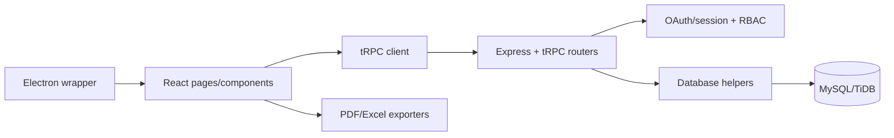

# Arkitektura

Aplikacioni është një monorepo TypeScript me React/Vite në browser dhe Express/tRPC në server. `client/src/App.tsx` regjistron route-t dhe layout-in; `client/src/pages` përmban ekranet; `client/src/components` përmban UI dhe dialogë; `server/_core` mban runtime/auth; `server/routers.ts` ekspozon kontratat tRPC; `server/db.ts` izolon query-t; `drizzle/schema.ts` dhe SQL migrations përshkruajnë database-n.

Rrjedha tipike është: përdoruesi autentikohet, UI thërret një procedure tRPC, router-i validon input-in me Zod dhe rolin/company scope, service/db kryen query ose mutation, dhe UI invalidon cache-in. `companyId` është kufiri kryesor multi-tenant dhe duhet të kalojë në çdo query biznesi.

Mos modifiko `server/_core` pa nevojë; ndiq kontratat ekzistuese dhe shto service/module files të veçantë.
